 
-----
 Left: Cross sections for the three major Higgs production processes as a function of center of mass energy \cite{Baer:2013cma}. The Zh ``Higgs-strahlung'' process dominates at 250 GeV. Right: Recoil mass spectrum against $Z\to\mu^+\mu^-$ for signal $e^+e^-\to Zh$ and SM background at 250 GeV \cite{Yan:2016xyx}.}
 
[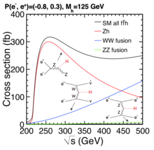](figures/xsec_h_ILC_left.pdf)[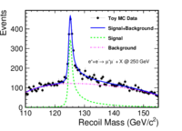](figures/RecoilMassLep250.pdf)

- ##### H. Baer et al., eds., The International Linear Collider Technical Design Report - Volume 2: Physics, https://arxiv.org/abs/1306.6352  1306.6352.  

- ##### J. Yan, S. Watanuki, K. Fujii, A. Ishikawa, D. Jeans, J. Strube et al., Measurement of the Higgs boson mass and $e^+e^- \to ZH$ cross section using $Z \to \mu^+\mu^-$ and $Z \to e^+ e^-$ at the ILC, https://doi.org/10.1103/PhysRevD.94.113002 Phys. Rev. D   94 (2016) 113002 [https://arxiv.org/abs/1604.07524  1604.07524].  

 
-----
B-tag (left) and c-tag (right) performance in full-simulation studies of two variants of the ILD concept, IDR-L and IDR-S (figure from \cite{ILDConceptGroup:2020sfq}).}
 
[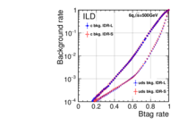](figures/btag_performance.pdf)[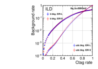](figures/ctag_performance.pdf)

- #####  ILD Concept Group collaboration, International Large Detector: Interim Design Report, https://arxiv.org/abs/2003.01116  2003.01116.  

 
-----
Comparison of signal and backgrounds from ILD full simulation for the measurement of the $\sigma\times BR$ for $H\to b\overline{b}$, for 250 fb$^{-1}$ of ILC data at 250 GeV, from \cite{Ogawa:2018ssv}.}
 
[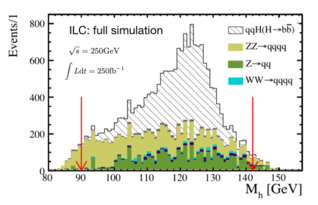](figures/bb250.pdf)

- ##### T. Ogawa, Sensitivity to anomalous VVH couplings induced by dimension-6 operators at the ILC, Ph.D. thesis, 2018.  

 
-----
Representative topologies of the Higgs exotic decays. 
 
[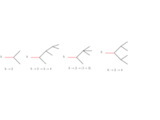](figures/topologies.pdf)

 
-----
The 95\ fractions into $jj+\missET$ arising from a decay $H\to X_2X_1$, as described in the text, with $X_1$ a stable particle of mass $m_1$ and $X_2$ higher in mass by  $m_2-m_1$.
 
[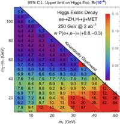](figures/Br95_jjMET.pdf)

 
-----
Stacked distribution of reconstructed average scalar mass for the signal $e^+e^-\to l^+l^- H$, $H\to \phi\phi\to (b\bar{b})(b\bar{b})$ and background events based on full detector simulation, at $\sqrt{s}=250$ GeV with an integrated luminosity of 900 fb$^{-1}$. Left figure is for $P(e^-,e^+)=(-0.8,+0.3)$ and right is for $P(e^-,e^+)=(+0.8,-0.3)$.}
 
[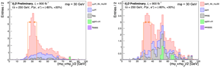](figures/mphi_H4b.pdf)

 
-----
 The 95\ branching fractions at HL-LHC and ILC, based on Ref \cite{Liu:2016zki
 
[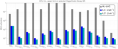](figures/summarybar.pdf)

- ##### Z. Liu, L.-T. Wang and H. Zhang, Exotic decays of the 125 GeV Higgs boson at future $e^+e^-$ lepton colliders, https://doi.org/10.1088/1674-1137/41/6/063102 Chin. Phys.   C41 (2017) 063102 [https://arxiv.org/abs/1612.09284  1612.09284].  

 
-----

 
[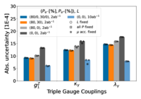](figures/TGC_pars_2f4f_ALRfix.pdf)[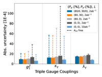](figures/TGC_pars_4f_ALRfree.pdf)

 
-----
(a) The groomed mass observable in $e^+e^-$ \cite{Kardos:2020gty}.  (b) A precision measurement of the two-point correlator in the collinear limit at the LHC \cite{Komiske:2022enw}. Both of these new observables provide interesting probes of $\alpha_s$
 
[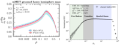](figures/Fig88replace.pdf)

- ##### A. Kardos, A.J. Larkoski and Z. Tr\'ocs\'anyi, Groomed jet mass at high precision, https://doi.org/10.1016/j.physletb.2020.135704 Phys. Lett. B   809 (2020) 135704 [https://arxiv.org/abs/2002.00942  2002.00942].  

- ##### P.T. Komiske, I. Moult, J. Thaler and H.X. Zhu, Analyzing N-point Energy Correlators Inside Jets with CMS Open Data, https://arxiv.org/abs/2201.07800  2201.07800.  

 
-----
Generalized angularities (a), and groomed angularities (b) measured on gluon jets with different event generators. Large discrepancies are observed due to a lack of tuning data. Figures courtesy of Gregory Soyez.
 
[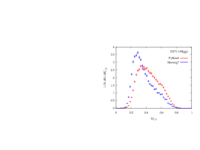](figures/gregory_Hgg.pdf)[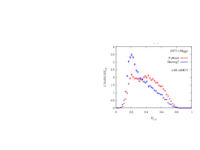](figures/gregory_Hgg_groomed.pdf)

 
-----
Precision perturbative calculations in $H\to gg$. In (a) we show a double logarithmic Sudakov event shape observable \cite{Mo:2017gzp}, and in (b) and single logarithmic collinear observable \cite{Dixon:2019uzg}.
 
[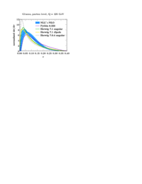](figures/tackmann_gluon.pdf)[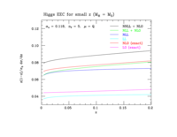](figures/zsmallzNNLLHiggs.pdf)

- ##### J. Mo, F.J. Tackmann and W.J. Waalewijn, A case study of quark-gluon discrimination at NNLL' in comparison to parton showers, https://doi.org/10.1140/epjc/s10052-017-5365-9 Eur. Phys. J. C   77 (2017) 770 [https://arxiv.org/abs/1708.00867  1708.00867].  

- ##### L.J. Dixon, I. Moult and H.X. Zhu, Collinear limit of the energy-energy correlator, https://doi.org/10.1103/PhysRevD.100.014009 Phys. Rev. D   100 (2019) 014009 [https://arxiv.org/abs/1905.01310  1905.01310].  

 
-----
Precision measurements of event shapes on Higgs decays used to bound the light quark Yukawas \cite{Gao:2016jcm}.
 
[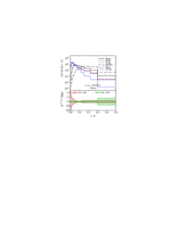](figures/Gao_1.pdf)

- ##### J. Gao, Probing light-quark Yukawa couplings via hadronic event shapes at lepton colliders, https://doi.org/10.1007/JHEP01(2018)038 JHEP   01 (2018) 038 [https://arxiv.org/abs/1608.01746  1608.01746].  

