These is a collection of figures from chapter 10 "ILC Physics Measurements at 350, 500, and 1000 GeV" of
A. Aryshev et al., The International Linear Collider: Report to Snowmass 2021, arXiv:2203.07622
Some of the captions may be mangled due to imperfect .tex -> .mk conversion. Check the above paper for the definitive version.

-----
A simulated top quark threshold scan with a total integrated luminosity of 200 fb$^{-1}$.  The bands around the central cross section curve show the dependence of the cross section on the top quark mass and width, illustrating the sensitivity of the scan.  The error bars show  the statistical uncertainties, taking into account signal efficiencies and backgrounds.  From \cite{CLICdp:2018esa}.
 

- #####  CLICdp collaboration, Top-Quark Physics at the CLIC Electron-Positron Linear Collider, https://doi.org/10.1007/JHEP11(2019)003 JHEP   11 (2019) 003 [https://arxiv.org/abs/1807.02441  1807.02441].  

 
-----
(a) The jet mass distribution on boosted top quark jets. (b) The peak position extracted using Pole mass or MSR mass schemes. \cite{Bachu:2020nqn}
 
[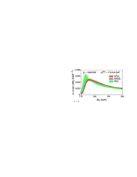](figures/adi_top.pdf)[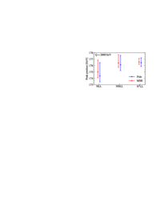](figures/adi_peak.pdf)

- ##### B. Bachu, A.H. Hoang, V. Mateu, A. Pathak and I.W. Stewart, Boosted top quarks in the peak region with NL3L resummation, https://doi.org/10.1103/PhysRevD.104.014026 Phys. Rev. D   104 (2021) 014026 [https://arxiv.org/abs/2012.12304  2012.12304].  

 
-----
(a) The angular scale of the top quark as probed by a three point correlation function. (b) The angular distribution for different top masses. Hadronization has an extremely minor impact on the peak position, leading to a clean probe of the top quark mass with perturbative physics \cite{Holguin:2022epo}.
 
[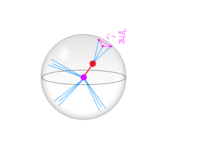](figures/top_EEEC.pdf)[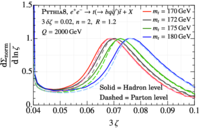](figures/ee_n2.pdf)

- ##### J. Holguin, I. Moult, A. Pathak and M. Procura, A New Paradigm for Precision Top Physics: Weighing the Top with Energy Correlators, https://arxiv.org/abs/2201.08393  2201.08393.  

 
-----
Comparison of current 95\% CL bounds on the coefficients of the two-fermion SMEFT operators  that affect the top and bottom quark EW couplings and the four-fermion operators $q\bar{q}t\bar{t}$. The LHC bounds correspond to the results of Ref. \cite{Miralles:2021dyw}, the HL-LHC S2 projection follows Ref. \cite{Durieux:2019rbz} and the HL-LHC Higgs report \cite{Cepeda:2019klc}, while the ILC prospects are based on Ref. \cite{Durieux:2018tev}.  Bars with dark shading show constraints on individual couplings considered separately,  while bars with light shading show constraints from a global fit to the full set of operators.
 
[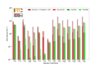](figures/Prospects_Linear_S2_ILC250_ILC500.pdf)

- ##### V. Miralles, M.M. L\'opez, M.M. Ll\'acer, A. Pe\ nuelas, M. Perell\'o and M. Vos, The top quark electro-weak couplings after LHC Run 2, https://arxiv.org/abs/2107.13917  2107.13917.  

- ##### G. Durieux, A. Irles, V. Miralles, A. Pe\ nuelas, R. P\"oschl, M. Perell\'o et al., The electro-weak couplings of the top and bottom quarks -- Global fit and future prospects, https://doi.org/10.1007/JHEP12(2019)098 JHEP   12 (2019) 98 [https://arxiv.org/abs/1907.10619  1907.10619].  

- ##### M. Cepeda et al., Report from Working Group 2: Higgs Physics at the HL-LHC and HE-LHC, https://doi.org/10.23731/CYRM-2019-007.221 CERN Yellow Rep. Monogr.   7 (2019) 221 [https://arxiv.org/abs/1902.00134  1902.00134].  

- ##### G. Durieux, M. Perell\'o, M. Vos and C. Zhang, Global and optimal probes for the top-quark effective field theory at future lepton colliders, https://doi.org/10.1007/JHEP10(2018)168 JHEP   10 (2018) 168 [https://arxiv.org/abs/1807.02121  1807.02121].  

 
-----
The projected 95\% C.L. bounds on the EFT operator coefficients that give rise to the FCNC $e^+e^- \rightarrow tq$ production process. The bounds are given in units of TeV$^{-2}$ for the LHC run 2 (dark red arrows), for the HL-LHC (purple arrows) and for the three nominal ILC stages: 250 GeV (green bars), 500 GeV (orange bars) and 1 TeV (blue bars). The round markers of the same color represent the expected bounds without beam polarization. 
 
[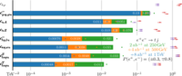](figures/limits_full_ilc_H-3.pdf)

- ##### A. Aryshev et al., The International Linear Collider: Report to Snowmass 2021, arXiv:2203.07622 

 
-----
Cross-sections for double Higgs production in the SM via Higgs-strahlung and $WW$ fusion as a function of the center-of-mass energy \cite{Durig:2016jrs}.
 
[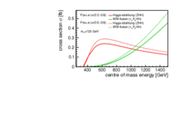](figures/crosssec_selfcoupling_other3_2.pdf)

- ##### C.F. D\"urig, Measuring the Higgs Self-coupling at the International Linear Collider, Ph.D. thesis, Hamburg U., Hamburg, 2016. \newblock 10.3204/PUBDB-2016-04283.  

 
-----
(a) Cross-sections for double Higgs production via Higgs-strahlung (at $\sqrt{s}=500$\,GeV) and $WW$ fusion (at $1$\,TeV) as a function of the triple-Higgs coupling (normalised to its SM value) \cite{Durig:2016jrs}. (b) Expected precision from each of the two ILC reactions as a function of the actual value of $\lambda$ relative to the SM value.
 
[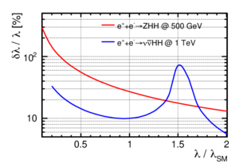](figures/precision_BSM_HHH.pdf)

- ##### C.F. D\"urig, Measuring the Higgs Self-coupling at the International Linear Collider, Ph.D. thesis, Hamburg U., Hamburg, 2016. \newblock 10.3204/PUBDB-2016-04283.  

 
-----
Expected uncertainties in the determination of the Higgs self coupling at the HL-LHC and the ILC as a function of $\lambda/\lambda_{SM}$.  The HL-LHC value for the SM value of $\lambda$ is that projected by the ATLAS collaboration in  \cite{ATLAS:2018rvj} that is then extrapolated to other values of the coupling. The ILC measurements at 500 GeV and 1 TeV are shown separately and, in red, in combination \cite{Durig:2016jrs}.}
 
[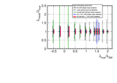](figures/lambda_rel.pdf)

- #####  ATLAS collaboration, Measurement prospects of the pair production and self-coupling of the Higgs boson with the ATLAS experiment at the HL-LHC, .  

- ##### C.F. D\"urig, Measuring the Higgs Self-coupling at the International Linear Collider, Ph.D. thesis, Hamburg U., Hamburg, 2016. \newblock 10.3204/PUBDB-2016-04283.  

 
-----
Expected precisions on the three triple gauge coupling parameters at the three energy stages of ILC. The results at $500$\,GeV and at $1$\,TeV are based on the ILD full simulation analyses of semi-leptonic $W$ pair production, extrapolated to include improvements from the fully hadronic channel and single-$W$ production as well as for upgrading from a binned analysis of three angles to an optimal observable technique \cite{Karl:2019hes}. The S1 scenario assumes the systematic uncertainties from \cite{Karl:2019hes}, the S2 illustrates the hypothetical reduction by a further factor 2-3 to the level of $1 \times 10^{-4}$. 
 
[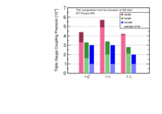](figures/DeltaTGCs_ILC.pdf)

- ##### R. Karl, From the Machine-Detector Interface to Electroweak Precision Measurements at the ILC \textemdash Beam-Gas Background, Beam Polarization and Triple Gauge Couplings, Ph.D. thesis, Hamburg U., Hamburg, 2019. \newblock 10.3204/PUBDB-2019-03013.  

- ##### R. Karl, From the Machine-Detector Interface to Electroweak Precision Measurements at the ILC \textemdash Beam-Gas Background, Beam Polarization and Triple Gauge Couplings, Ph.D. thesis, Hamburg U., Hamburg, 2019. \newblock 10.3204/PUBDB-2019-03013.  

 
-----
Visibility of deviations from the SM predictions in $g_{b_j}^Z$, $g_{b_j}^Z$ (to do: still missing in this plot) and the helicity amplitudes $Q_{e_i b_j}$, in  standard deviations,  from combined ILC250/Z-Pole running, expected from new physics models with Randall-Sundrum extra dimensions \cite{Djouadi:2006rk,Funatsu:2017nfm,Yoon:2018xud}.
 
[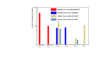](figures/stdv.pdf)

- ##### A. Djouadi, G. Moreau and F. Richard, Resolving the A(FB)**b puzzle in an extra dimensional model with an extended gauge structure, https://doi.org/10.1016/j.nuclphysb.2007.03.019 Nucl.Phys.   B773 (2007) 43 [https://arxiv.org/abs/hep-ph/0610173  hep-ph/0610173].  

- ##### S. Funatsu, H. Hatanaka, Y. Hosotani and Y. Orikasa, Distinct signals of the gauge-Higgs unification in $e^+e^-$ collider experiments, https://doi.org/10.1016/j.physletb.2017.10.068 Phys. Lett.   B775 (2017) 297 [https://arxiv.org/abs/1705.05282  1705.05282].  

- ##### J. Yoon and M.E. Peskin, Fermion Pair Production in SO(5) x U(1) Gauge-Higgs Unification Models, https://arxiv.org/abs/1811.07877  1811.07877.  

 
-----
 Exclusion and discovery reaches for a $\XPM{1}$ (left), or a $\stone$ (right). In both cases, the horizontal axis is the mass of the charged SUSY particle and the vertical axis is the mass splitting between this state and the (neutral) lightest SUSY particle.}
 
[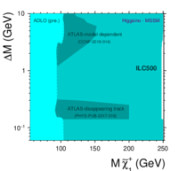](figures/exclusion_complete_higgsino.pdf)[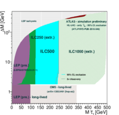](figures/stau_exclusion_extrapolations.pdf)

- ##### A. Aryshev et al., The International Linear Collider: Report to Snowmass 2021, arXiv:2203.07622 

 
-----
 Observed or projected exclusion regions for a $\XPM{1}$ NLSP, for LEPII, LHC, HL-LHC.  The vertical lines indicate the model-independent reach of ILC-500 and ILC-1000. The symbols very close to the line $\MXN{1} = \MXC{1}$ indicate the location of the  Higgsino LSP models shown in Fig. \ref{fig:sleptC1N2}.} 
 
[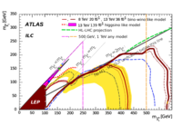](figures/fig_08d_w_lep_w_lhc2019_lodm_w_bmark_w_hlproj_rad_nat_only_C1-012.pdf)

- ##### A. Aryshev et al., The International Linear Collider: Report to Snowmass 2021, arXiv:2203.07622 

 
-----
Top row: $\stau$, $\smu$ and $\sel$ spectra. Middle and bottom rows: Observables for three different Higgsino-LSP models. The middle row shows the case of $\XPM{1}$ production, the bottom one that of $\XN{2}$ production.  
 
[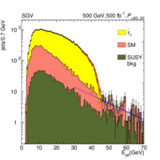](figures/stau11-stc-epj-style_wmissch.pdf)[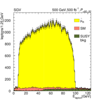](figures/smurr_tnphs_rl_006_selcuts_skim_whiz6_epj.pdf)[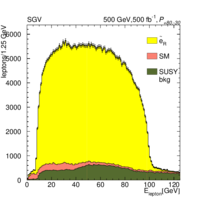](figures/serr_tnphs_rl_006_selcuts_skim_whiz6_epj.pdf)[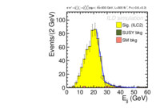](figures/fit_ilc2C_EmL.pdf)[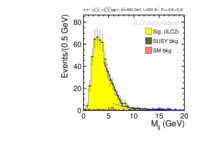](figures/fit_ilc2C_MmL.pdf)[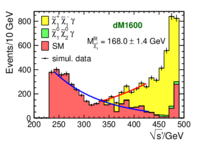](figures/MrecoilC_mh124.pdf)[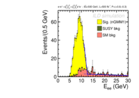](figures/fit_ngmm1_EeR.pdf)[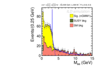](figures/fit_ngmm1_MeR.pdf)[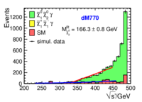](figures/MrecoilN_mh127.pdf)

- ##### A. Aryshev et al., The International Linear Collider: Report to Snowmass 2021, arXiv:2203.07622 

 
-----
 (a) Recoil mass distributions for several new scalars and the SM background. (b) Projected exclusion limit for new scalars, in terms of the coupling compared to the coupling an SM Higgs at the same mass would have. 
 
[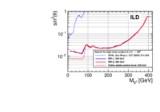](figures/exclusion_limits_08_03_compare_LEP.pdf)

- ##### A. Aryshev et al., The International Linear Collider: Report to Snowmass 2021, arXiv:2203.07622 

 
-----
Significance of the deviations from the Standard Model predictions for the extended Higgs bosons of the Inert Doublet Model, as expected for 1 ab$^{-1}$ of data collected at center-of-mass energy of 250\,GeV, 380\,GeV and   500\,GeV, from \cite{Zarnecki:2019poj,Sokolowska:2019xhe}.  Left:  for events with two muons in the final state ($\mu^+\mu^-$), as a function of the sum of neutral inert scalar masses; Right: for events with an electron and a muon in the final state ($e^+\mu^-$ or $e^-\mu^+$) as a function of twice the charged scalar mass.  }
 
[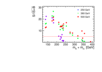](figures/signif_bdt2_ah_new.pdf)[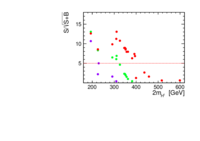](figures/signif_bdt2_hphm_new.pdf)

- ##### A.F. Zarnecki, J. Kalinowski, J. Klamka, P. Sopicki, W. Kotlarski, T. Robens et al., Inert Doublet Model Signatures at Future e+e- Colliders, https://doi.org/10.22323/1.360.0010 PoS   ALPS2019 (2020) 010 [https://arxiv.org/abs/1908.04659  1908.04659].  

- ##### D. Sokolowska, J. Kalinowski, J. Klamka, P. Sopicki, A.F. Zarnecki, W. Kotlarski et al., Inert Doublet Model signatures at future $e^+e^-$ colliders, https://doi.org/10.22323/1.364.0570 PoS   EPS-HEP2019 (2020) 570 [https://arxiv.org/abs/1911.06254  1911.06254].  

 
-----
 (a): Observational reach (2$\sigma$) of the ILC for a fermionic WIMP with a WIMP-fermion vector coupling in terms of the WIMP mass for four different beam-polarization configurations \cite{Habermehl:417605
 
[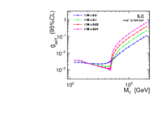](figures/ilc2_sys_all_coupling_Xd_Yv_wid.pdf)

- ##### M. Habermehl, Dark Matter at the International Linear Collider, dissertation, Universität Hamburg, Hamburg, 2018.  https://bib-pubdb1.desy.de/record/417605 .  

 
-----
Parameter space of the type-II seesaw model in the plane of the mass of the doubly-charged scalar boson $H^{++}$ and the vacuum expectation value $v_T$ of the neutral component of the $I=1$ scalar field, from \cite{Antusch:2018svb}.  The upper limit on $v_T$ comes from the value of the $\rho$ parameter.  The strongest lower limits come from direct searches for $H^{++}$ in its decay to like-sign dileptons. The region labeled LLP can be explored at the LHC  in searches for displaced decays.  In the remaining allowed region, the dominant decays of the $H^{++}$ are 3-body decays to $W^+f\bar f$.}
 
[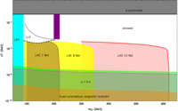](figures/Antusch18.pdf)

- ##### S. Antusch, O. Fischer, A. Hammad and C. Scherb, Low scale type II seesaw: Present constraints and prospects for displaced vertex searches, https://doi.org/10.1007/JHEP02(2019)157 JHEP   02 (2019) 157 [https://arxiv.org/abs/1811.03476  1811.03476].  

 
-----
Sensitivity reach in the mixing angle for production of the heavy $I=1$ lepton in Type III seesaw models, using the final state $e + \missET+$ boosted jet, from \cite{Das:2020gnt}. Left: ILC at 1 TeV with varying levels of integrated luminosity; Right: $\ee$ at 3 TeV with varying levels of integrated luminosity.  The solid lines show upper bounds from  precision electroweak observables, from \cite{delAguila:2008pw}.}
 
[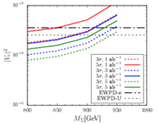](figures/Das1.pdf)[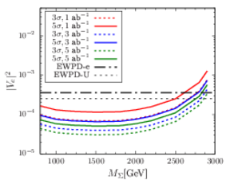](figures/Das3.pdf)

- ##### A. Das, S. Mandal and T. Modak, Testing triplet fermions at the electron-positron and electron-proton colliders using fat jet signatures, https://doi.org/10.1103/PhysRevD.102.033001 Phys. Rev. D   102 (2020) 033001 [https://arxiv.org/abs/2005.02267  2005.02267].  

- ##### F. del Aguila, J. de Blas and M. Perez-Victoria, Effects of new leptons in Electroweak Precision Data, https://doi.org/10.1103/PhysRevD.78.013010 Phys. Rev. D   78 (2008) 013010 [https://arxiv.org/abs/0803.4008  0803.4008].  

 
-----
Left: \textit{qql} mass distribution for ILC500 for muons in the final state. Black solid line stands for the $e^+e^-$ background, red dashed line for the $\gamma$-induced background and thick green line for a reference signal scenario (Dirac neutrino with a mass of 300\,GeV). Right: limits on the coupling $V^2_{lN}$ for different colliders (solid lines: ILC500 -- green, ILC1000 -- violet, CLIC3000 -- dark red). Dashed lines indicate limits from current and future hadron colliders based on \cite{Sirunyan:2018mtv,Pascoli:2018heg}. Figure taken from \cite{Mekala:2022cmm}.
 
[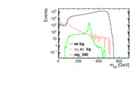](figures/mass_ILC500_mu.pdf)

- #####  CMS collaboration, Search for heavy neutral leptons in events with three charged leptons in proton-proton collisions at $\sqrts =$ 13 TeV, https://doi.org/10.1103/PhysRevLett.120.221801 Phys. Rev. Lett.   120 (2018) 221801 [https://arxiv.org/abs/1802.02965  1802.02965].  

- ##### S. Pascoli, R. Ruiz and C. Weiland, Heavy neutrinos with dynamic jet vetoes: multilepton searches at $ \sqrts=14 $ , 27, and 100 TeV, https://doi.org/10.1007/JHEP06(2019)049 JHEP   06 (2019) 049 [https://arxiv.org/abs/1812.08750  1812.08750].  

- ##### K. Mekala, J. Reuter and A.F. \.Zarnecki, Heavy neutrinos at future linear e$^+$e$^-$ colliders, https://doi.org/10.1007/JHEP06(2022)010 JHEP   06 (2022) 010 [https://arxiv.org/abs/2202.06703  2202.06703].  

 
-----
  (a) Exclusion reach for Right-handed Heavy Neutrinos. (b) Comparison of the value of the neutrino atmospheric mixing angle $\sin^2\theta_{23}$  to the value obtained from the ILC measurements of the neutralino decay branching ratios in the R-parity  violating  model described in the text, from \cite{Vormwald:2013sfm}. }
 
[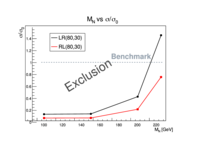](figures/exclusion_righthanded_N.pdf)[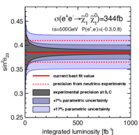](figures/ListVormwald.pdf)

- ##### B. Vormwald and J. List, Bilinear $R$ parity violation at the ILC: neutrino physics at colliders, https://doi.org/10.1140/epjc/s10052-014-2720-y Eur. Phys. J. C   74 (2014) 2720 [https://arxiv.org/abs/1307.4074  1307.4074].  

 
-----
Projected reach of HL-LHC, Belle-II and the ILC for the dark $Z$ gauge boson, in terms of its mass and the kinetic mixing parameter $\varepsilon$ \cite{EuropeanStrategyforParticlePhysicsPreparatoryGroup:2019qin,Berggren:2021lan}. 
 
[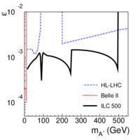](figures/ilc-full_sc_w_belle_lhc_wkey.pdf)

- ##### R.K. Ellis et al., Physics Briefing Book: Input for the European Strategy for Particle Physics Update 2020, https://arxiv.org/abs/1910.11775  1910.11775.  

- #####  ILD concept group collaboration, New physics searches with the International Large Detector at the ILC,  in Particles and Nuclei International Conference , 11, 2021 [https://arxiv.org/abs/2111.09928  2111.09928].  

 
-----
Left- and right-handed couplings of dark $Z$ to leptons, measured by a short dedicated ILC run on the dark $Z$ resonance (assumed to be at 400 GeV in this illustrative example). The benchmark model generates parity-violating dark $Z$ couplings to matter through a combination of mass and kinetic mixing. Orange, blue and green lines correspond to alternative models that can be ruled out by this measurement. From Ref. \cite{San:2022uud}. 
 

- ##### Y.C. San, M. Perelstein and P. Tanedo, Dark Z at the International Linear Collider, https://doi.org/10.1103/PhysRevD.106.015027 Phys. Rev. D   106 (2022) 015027 [https://arxiv.org/abs/2205.10304  2205.10304].  

 
-----
Left panel: Sensitivity projections for long-lived ALPs with $m_a = 300$ MeV at the ILC and at Belle II, as a function of the couplings $c_{WW}/f_a$ and $c_{ll}/f_a$. Right panel: Sensitivity projections for long-lived ALPs with $m_a = 300$ MeV at the ILC main detector (ILD), and three dedicated far-detector options (Ground, Shaft, and Tunnel). From Ref. \cite{Schafer:2022shi}. 
 
[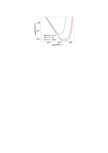](figures/ILC_vs_Belle_ALP_LLP.pdf)[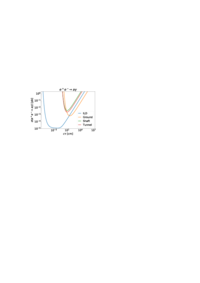](figures/Near_vs_Far_LLP.pdf)

- ##### R. Sch\"afer, F. Tillinger and S. Westhoff, Near or Far Detectors? Optimizing Long-Lived Particle Searches at Electron-Positron Colliders, https://arxiv.org/abs/2202.11714  2202.11714.  

 
-----
Efficiency of track reconstruction as a function of the long-lived particle decay length s$_\textrm{LLP}$, for example scenarios with decays of heavy neutral scalar A to lighter heavy scalar H and a pair of muons, for two heavy scalar mass differences of 1\,GeV and 5\,GeV.  
 
[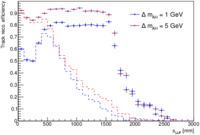](figures/trackEffVsL_report.pdf)

- ##### A. Aryshev et al., The International Linear Collider: Report to Snowmass 2021, arXiv:2203.07622 

