Scans over the parameter set of the MSSM giving models that account for the current discrepancy between the observed value of the muon $g-2$ and the consensus SM prediction, from \cite{Chakraborti:2021mbr}.   Left: Higgsino LSP; Right: Wino LSP. Other scenarios are described in the text.  Color encodes the predicted value of the LSP dark matter density, with green indicating a higher value.}
 
 
M. Chakraborti, S. Heinemeyer, I. Saha and C. Schappacher, $(g-2)_\mu$ and SUSY Dark Matter: Direct Detection and Collider Search Complementarity, https://arxiv.org/abs/2112.01389  2112.01389.  

Fractional deviations of the Higgs boson couplings from their SM values in supersymmetry models with very heavy SUSY partners:  Top: effect on the $Hbb$ couplings in a  class of supersymmetry models with $b$-$\tau$ Yukawa unification, from~\cite{Wells:2017vla}.  $M_\Phi$ is the mass of a heavy boson in the extended Higgs sector of the model.   The extended Higgs sector is excluded by LHC searches above the solid line.  The expected exclusion limit at the HL-LHC is shown by the dotted line.  Bottom: range of effects on the $Hbb$ and $H\tau\tau$ couplings induced by loop corrections involving heavy SUSY states, from~\cite{Endo:2015oia}. The black line shows the tree-level prediction due to the 2-Higgs doublet structure, for $\tan\beta = 5$~--50.}
[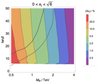](figures/WellsZhang.pdf) 
[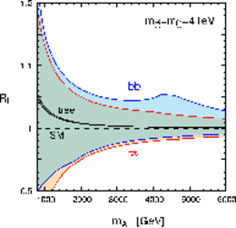](figures/EndoSUSY.pdf) 
J.D. Wells and Z. Zhang, Effective field theory approach to trans-TeV supersymmetry: covariant matching, Yukawa unification and Higgs couplings, https://doi.org/10.1007/JHEP05(2018)182 JHEP   05 (2018) 182 [https://arxiv.org/abs/1711.04774  1711.04774].  

LHC bounds on a 2-Higgs-doublet model with specific couplings to the strange quarks as a function of the heavy Higgs mass $m_H$. The scale on the right-hand side shows show the corresponding enhancement of the 125GeV Higgs Yukawa coupling to strange quarks. From~\cite{Egana-Ugrinovic:2021uew}, with the ILC expectation from \cite{Albert:2022mpk} added.}
[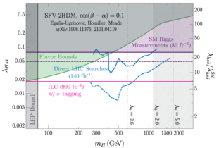](figures/exclusion_plot_strange_Homller.pdf) 
D. Egana-Ugrinovic, S. Homiller and P. Meade, Multi-Higgs Production Probes Higgs Flavor, https://doi.org/10.1103/PhysRevD.103.115005 Phys. Rev. D   103 (2021) 115005 [https://arxiv.org/abs/2101.04119  2101.04119].  

Mass reach of Higgs boson coupling deviations in  a variety of scenarios reviewed in~\cite{Peskin:2022pfv}.   The curves give the 3$\sigma$ sensitivity for particular Higgs boson couplings as a function of the new particle mass and a dimensionless parameter relevant to each scenario.  The red curves on the right give the 5$\sigma$ discovery contour for a fit of the full set of Higgs boson coupling measurements to ILC data.  The scenarios are:  (upper left) the Strongly Interacting Light Higgs, (upper right) two-Higgs doublet models, (lower left) models with a scalar singlet, (lower right) integration out of a vectorlike quark doublet.}
[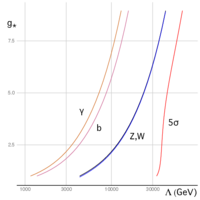](figures/SILH.pdf) 
[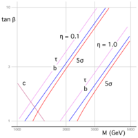](figures/THDMII.pdf) 
[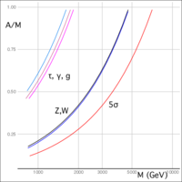](figures/singlet.pdf) 
[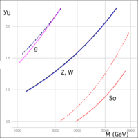](figures/vectorlike.pdf) 
M.E. Peskin, Model-Agnostic Exploration of the Mass Reach of Precision Higgs Boson Coupling Measurements,  in 2022 Snowmass Summer Study, 9, 2022 [https://arxiv.org/abs/2209.03303  2209.03303].  

Relative deviations of the Higgs boson couplings in six  diverse models of new physics. First row: 2-Higgs doublet models; Second row: Little Higgs models; Third row: a Composite Higgs model and a Scalar Singlet model. Error intervals shown are those for the ILC500.  From~\cite{Barklow:2017suo}; see this reference for more details.}
 
[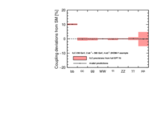](figures/coup_dev_500_2HDM-Y.pdf) 
[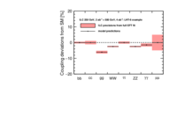](figures/coup_dev_500_LHT-6.pdf) 
[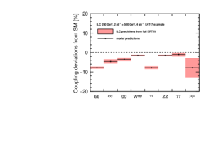](figures/coup_dev_500_LHT-7.pdf) 
[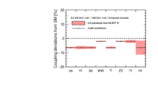](figures/coup_dev_500_Composite.pdf) 
 
T. Barklow, K. Fujii, S. Jung, R. Karl, J. List, T. Ogawa et al., Improved Formalism for Precision Higgs Coupling Fits, https://doi.org/10.1103/PhysRevD.97.053003 Phys. Rev.   D97 (2018) 053003 [https://arxiv.org/abs/1708.08912  1708.08912].  

