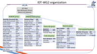
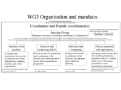
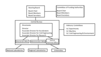
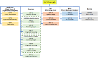
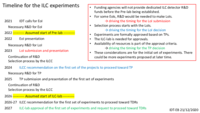

- The current organization of the IDT WG2.
 

- The current organization of the IDT WG3.
 

- The proposed organization of the ILC Pre-Lab.
 

- The proposed Work Packages of the ILC Pre-Lab.
 

- The originally envisioned timeline for the Pre-Lab and ILC detectors.
 

