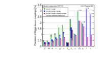
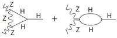

# Projected Higgs boson coupling uncertainties for ILC250, ILC500, and ILC1000, also  incorporating  results expected from the HL-LHC, based on the SMEFT analysis described in the text.   The darker bars show the results allowing invisible and exotic Higgs decay channels; the lighter bars assume that these BSM decays are not present.  The column $\lambda$ refers to the $HHH$ coupling.  In the last four columns, all bars are rescaled by the indicated factor.   From \cite{LCCPhysicsWorkingGroup:2019fvj}.}
 
 LCC Physics Working Group collaboration, Tests of the Standard Model at the International Linear Collider, https://arxiv.org/abs/1908.11299  1908.11299.  

# Vertex correction giving a dependence of the $HZZ$ and $HWW$ vertices on the Higgs self-coupling.
 

