- Steady progress in single and multi-cell cavity gradients over 3+ decades \cite{Yamamoto:2019}.
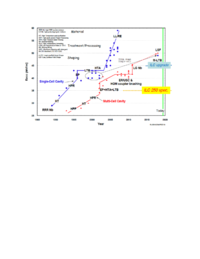 
A. Yamamoto in ESPP Symposium 2019, 2019.  

- 9-cell test results from DESY on $> 40$ cavities produced and treated by Research Instruments (RI) \cite{Pekeler:2016}.
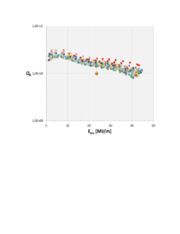 
M. Pekeler, Superconducting RF Cavity System Production for Particle Accelerators in Scientific and Industrial Applications,  in Proceedings of ICHEP 2016, 2016.  

-  (a) Q = $5\times 10^{10}$ at 30 MV/m by baking at 300~C to dissolve the natural oxide (and other surface layers) into the bulk, but not exposing the cavity to air or water before RF measurements; (b) IHEP (China) results on mid-T baking for 9-cell cavities compared to results on the same cavities with the standard ILC treatment~\cite{He:2020ptd}; (c) 300~C baking results from KEK on single cell cavities after high pressure water rinsing.  Standard ILC treatment results are also included.
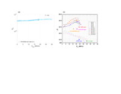 
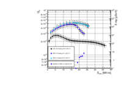 
F. He et al., Medium-temperature furnace bake of Superconducting Radio-Frequency cavities at IHEP, https://arxiv.org/abs/2012.04817  2012.04817.  

- Comparison of the performance of several 1-cell cavities from N-infusion with cavities prepared by the standard ILC recipe of EP and 120~C baking.
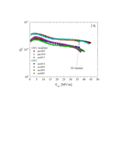 

-  (a):  $Q$ vs. $E$ curve of 1-cell cavity reaching 49 MV/m from Cold EP/optimized baking (75/120~C) compared to the curve of a cavity prepared by the standard ILC recipe. (b) Histogram of gradients of a large number of single cell cavities prepared by Cold EP/optimized baking (75/120~C). 
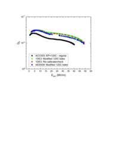 

-  (a) Gradients greater than 50~MV/m demonstrated in single cell cavities of various improved shapes. (b) Comparison of RE (top), LL/ICHIRO (middle) and TESLA (bottom) cavity cell shapes.  Here,  color is magnetic field intensity, red highest, blue lowest.   (c) Record gradient near 59~MV/m demonstrated with the RE shape (60~mm aperture).
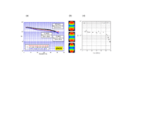 

- The TW structure compared to the one-meter standing-wave ILC structure.
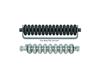 

-  (a) 1-cell TW Niobium structure with return waveguide, treated by BCP and tested to reach 26 MV/m. (b) 3-cell TW structure built but not yet tested.
 

- (a) Record CW behavior for Nb$_3$Sn coated with the solid state diffusion method at Fermilab showed $E_{acc}$ =  23 MV/m.  Excellent performance was obtained by making a smooth thin film about 1~$\mu$m. (b) Measurements of the critical RF field of Nb$_3$Sn using high power pulsed RF.  The high temperature results extrapolate to a maximum surface magnetic field of 300 mT, which would translate to $E_{acc}$ = 85 MV/m for a Low-Loss shape cavity.
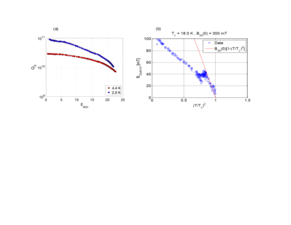 

- Schematic layout of the ILC in the $250\,{\mathrm{GeV}}$ staged configuration. \label{fig:ilc-schematic}}
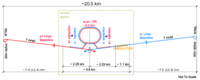 

- A $1.3\,{\mathrm{GHz}}$ superconducting niobium nine-cell cavity. }
 

- An ILC type cryomodule. \copyright Rey.Hori/KEK.
 

- Examples of the $Q_0\,(E\sub{acc})$ curves of some of the best cavities, either treated at RI using ``EP final'', or at EZ using ``BCP flash.'' \cite[Fig. 19]{Singer:2016fbf}. RI employs a production process that closely follows the ILC specifications, with a final electropolishing step. The ILC gradient / $Q_0$ goals are overlaid.}
 
W. Singer et al., Production of superconducting 1.3 GHz cavities for the European X-ray Free Electron Laser, https://doi.org/10.1103/PhysRevAccelBeams.19.092001 Phys. Rev. Accel. Beams   19 (2016) 092001.  

- Distribution and yield of the ``as received'' maximum gradient of cavities produced for the European XFEL, separated by vendor \cite[Fig. 33]{Reschke:2017gjp}. Vendor RI employs a production process that closely follows the ILC specifications, with a final electro polishing step.}
 
D. Reschke et al., Performance in the vertical test of the 832 nine-cell 1.3 GHz cavities for the European X-ray Free Electron Laser, https://doi.org/10.1103/PhysRevAccelBeams.20.042004 Phys. Rev. Accel. Beams   20 (2017) 042004.  

- An European XFEL type coupler.  }
 

- View of installed cryomodules in the tunnel of the European XFEL~\cite{Reschke:2018ywk}. }
 
D. Reschke, W. Decking, N. Walker and H. Weise, The commissioning of the European XFEL Linac and its performance,  in Proceedings, 18th International Conference on RF Superconductivity (SRF2017): Lanzhou, China, Jul 17--21, 2017, pp. 1--5 (MOXA02), 2018, https://doi.org/10.18429/JACoW-SRF2017-MOXA02 DOI.  

- Average of the operating (blue) and maximum (green) gradient for cavities in each European XFEL serial-production cryomodule. The specification of \siunit{23.6}{MV/m} is marked by a red line \cite{Kasprzak:2018kkr}.  Modules 98 and 99 were assembled from the lowest-performing cavities.}
 
K. Kasprzak et al., Test Results of the European XFEL Serial-production Accelerator Modules,  in Proceedings, 18th International Conference on RF Superconductivity (SRF2017), Lanzhou, China, July 17-21, 2017, pp. 312--316 (MOPB106), 2018, https://doi.org/10.18429/JACoW-SRF2017-MOPB106 DOI.  

- Electron phase  profile of an \siunit{800}{MHz} klystron employing the Core Oscillation Method (COM)~\cite{Constable:2017hha}. }
 
D. Constable et al., High efficiency klystron development for particle accelerators,  in Proceedings, 58th ICFA Advanced Beam Dynamics Workshop on High Luminosity Circular $e^+ e^-$ Colliders (eeFACT2016), Daresbury, UK, Oct 24--27, 2016, pp. 185--187 (WET3AH2), 2017, https://doi.org/10.18429/JACoW-eeFACT2016-WET3AH2 DOI.  

- Artist's rendition of the ILC Main Linac tunnel. The shield wall in the middle has been removed. \copyright Rey.Hori/KEK.}
 

- Cross section through the Main Linac tunnel.
 

- Cryogenic layout for a gradient of \siunit{31.5}{MV/m} (top) and \siunit{35}{MV/m} (bottom)~\cite{Evans:2017rvt}. ``Module space'' indicates how many cryomodules can be physically installed, ``cryomodules'' and ``RF unit'' indicates the number of actually installed modules and klystrons (one klystron per 4.5 cryomodules). ``E gain'' indicates the energy gain in GeV. ``BC'', ``ML'', ``e+ inj'', ``e- inj'' and ``UND'' refer to the sections with need for liquid helium: bunch compressor, main linac, 5GeV boosters in the positron and electron source, and the positron source undulator section, respectively. PM$\pm8, 10, 12$ refer to access hall locations, ``C'' to cryo plants; meter numbers on top indicate the length of the corresponding section.}
 
 
 Linear Collider Collaboration collaboration, The International Linear Collider Machine Staging Report 2017, https://arxiv.org/abs/1711.00568  1711.00568.  

- Beamsizes achieved at the Accelerator Test Facility 2 (ATF2) as a function of time~\cite{bib:atf2esu}. The latest result (\siunit{41}{nm}~\cite{Okugi:2017jji}) is within $10\,\ \label{fig:atf-results}
 
A. Latina and A. Faus-Golfe, ``ATF2.'' Input paper for European Strategy for Particle Physics Update, 2018.  

-  \includegraphics[width=\hsize]{chapters/accelerator/figures/Kitakami_Geology}Geological situation at the Kitakami site.
 

- The Kitakami candidate site for the ILC~\cite{Warmbein:2014a}.
 
B. Warmbein, ``The road to Kitakami.'' ILC Newsline Feb. 20, 2014,  http://newsline.linearcollider.org/2014/02/20/the-road-to-kitakami/, 2014.  

- Schematic for the concept of Green ILC.
 

- Illustrations of R\&D for high-efficiency components of the ILC. Upper left: a proposal for efficient refrigerator, Lower left: proposals for a high efficiency power source; Upper right: examples of high-Q and high-gradient cavities;  Lower right: a proposal for a beam dump with wake field deceleration.
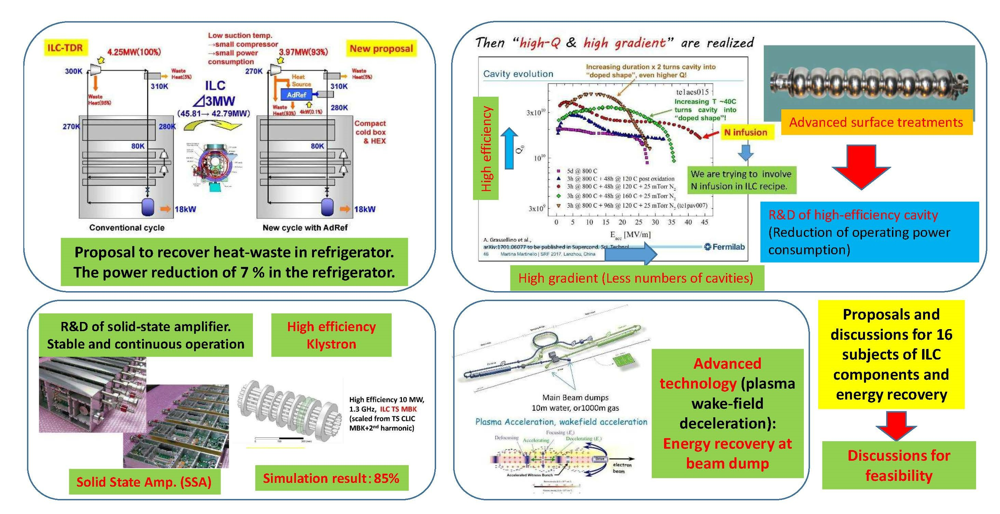 

- Proposals for a  smart power grid (left) and  biomass power network (right) for the  ILC city.
 

- A proposal to use the waste heat of ILC tunnel for drying biomass.
 

- Breakdown of total CO$_2$ emission in Ichinoseki city, including the contribution from the ILC Laboratory.
 

- Breakdown of Value costs into accelerator systems (left) and technical systems (right) for the \siunit{250}{GeV} ILC accelerator, assuming that cost reduction measures are successful and a gradient of \siunit{35}{MV/m} can be reached. \label{fig:costs}}
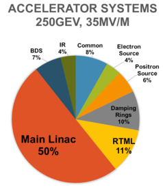 
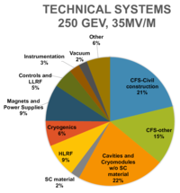 

- Summary of the Work Packages for the technical preparations that will be carried out during the ILC Pre-Lab period.}
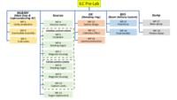 

- Cutaway view of an ILC cryomodule.  (Image by Rey Hori \cite{HoriCryo}.)
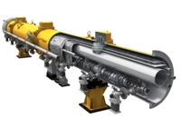 
R. Hori.  http://www.yk.rim.or.jp/ reyhori/pages/galacc4_e.htm, 2017.  

- View of some of the cryomodule assembly facilities at Fermilab (left) and Jefferson Lab (right).
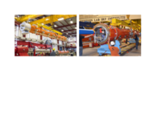 

