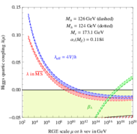
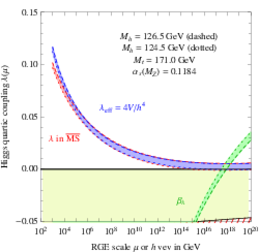
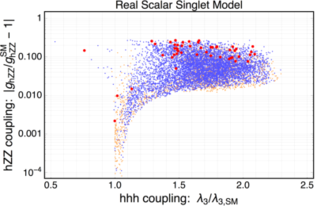
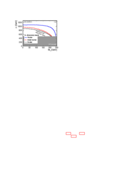
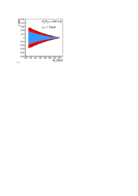

top: Regions of stability, metastability, and instability of the SM vacuum, shown as a function of $m_H$ and $m_t$,showing the current best values in the region of metastability. bottom: Renormalization-group evolution of the Higgs quartic coupling to large $Q$ assuming $m_t = 173.1$~GeV (left) and $m_t = 171.0$~GeV (right). From~\cite{Degrassi:2012ry}. 
 
 
 
G. Degrassi, S. Di Vita, J. Elias-Miro, J.R. Espinosa, G.F. Giudice, G. Isidori et al., Higgs mass and vacuum stability in the Standard Model at NNLO, https://doi.org/10.1007/JHEP08(2012)098 JHEP   08 (2012) 098 [https://arxiv.org/abs/1205.6497  1205.6497].  

Scan of the parameter space for a model of baryogenesis at the electroweak scale with one new electroweak singlet Higgs field mixing with the SM Higgs doublet, from \cite{Huang:2016cjm}. Blue points represent models with a strong first-order electroweak phase transition, required for successful baryogenesis.
 
P. Huang, A.J. Long and L.-T. Wang, Probing the Electroweak Phase Transition with Higgs Factories and Gravitational Waves, https://doi.org/10.1103/PhysRevD.94.075008 Phys. Rev. D   94 (2016) 075008 [https://arxiv.org/abs/1608.06619  1608.06619].  

Left: ILC reach for dark matter particle coupled to electrons through an effective dim.-6 operator of various spin structures. Right: Fractional accuracy of WIMP mass determination at the ILC using the fit to a photon spectrum in the $\gamma+$inv. final state.
 
 

