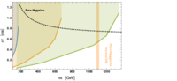

This is a collection of figures from Chapter 15 "Long-Term Future of the ILC Laboratory" of "A. Aryshev et al., The International Linear Collider: Report to Snowmass 2021" https://arxiv.org/abs/2203.07622

Some captions may be mangled due to imperfect .tex -> .mk conversion: check the above paper for the definitive version.
 
-----
Left: Cross section of the two leading diHiggs production modes in a lepton collider as a function of the center-of-mass energy. Right: Dependence of the signal strengths on the trilinear coupling of the Higgs with the horizontal bands showing the estimated sensitivities.
 

- ##### A. Aryshev et al., The International Linear Collider: Report to Snowmass 2021, arXiv:2203.07622 

 
-----
Composite Higgs reach from Higgs boson, top quark and Drell-Yan studies taken from Refs. \cite{deBlas:2018mhx} and \cite{CLICdp:2018esa}. Left panel: $5\sigma$ discovery contours for Higgs compositeness in the $(m_{*},g_{*})$ plane, and as well the $2\sigma$ projected exclusions from the HL-LHC. Right panel: The $5\sigma$ top quark compositeness discovery contours in the $(m_{*},g_{*})$ planes from studies of $t\overbar{t}$ and $t\overbar{t}h$ final states. In both panels, darker and lighter shaded areas correspond to the variations of the size of the operators' coefficients by a factor of 2 or 1/2 on top of the baseline expectation from the values of $m_{*}$ and $g_{*}$.}
 

- ##### J. de Blas et al., The CLIC Potential for New Physics, https://arxiv.org/abs/1812.02093  1812.02093.  

- #####  CLICdp collaboration, Top-Quark Physics at the CLIC Electron-Positron Linear Collider, https://doi.org/10.1007/JHEP11(2019)003 JHEP   11 (2019) 003 [https://arxiv.org/abs/1807.02441  1807.02441].  

 
-----
Reach of direct searches for Dark Matter. Left panel: 95\% excluded masses for new electroweak $n$-plet states with hypercharge $Y$. The exclusion results for each state denoted by (1,n,$Y$) at CLIC Stage2 and Stage3 are presented in green and yellow bar \cite{DiLuzio:2018jwd}. Right panel: 95\% excluded region for pure Higgsino in the mass-lifetime plane. The black dashed line denotes the lifetime of a pure Higgsino. The green, yellow and blue areas correspond to 3 TeV, 1.5 TeV and 380 GeV CLIC expected exclusions, respectively.
 

- ##### L. Di Luzio, R. Gr\"ober and G. Panico, Probing new electroweak states via precision measurements at the LHC and future colliders, https://doi.org/10.1007/JHEP01(2019)011 JHEP   01 (2019) 011 [https://arxiv.org/abs/1810.10993  1810.10993].  

 
-----
Event rates and exclusions for the wino and higgsino signal in the lifetime vs. mass plane. Orange: darker region corresponds to $N > 30$ events in the CLIC acceptance, lighter orange regions corresponds to $N > 3$ events and correspond to a projected 95\% C.L. exclusion limit for zero expected background. The left (right) panel refers to the RPV wino (higgsino) signal. Blue region: the recasted current and HL-LHC (3 $\rm ab^{-1}$) projected 95\% C.L. exclusion limit as the function of Wino mass and its lifetime.}
 

- ##### A. Aryshev et al., The International Linear Collider: Report to Snowmass 2021, arXiv:2203.07622 

 
-----
Blue line: HL-LHC projected 95\% C.L. exclusion limit for the Higgs portal singlet model as the function of $c\tau_\chi$ for $m_\chi=30$ GeV. Orange line: projection for CLIC with the same model.
 

- ##### A. Aryshev et al., The International Linear Collider: Report to Snowmass 2021, arXiv:2203.07622 

 
-----
Schematic layout of the CLIC complex at \SI{380}{\GeV}.
 

- ##### A. Aryshev et al., The International Linear Collider: Report to Snowmass 2021, arXiv:2203.07622 

 
-----
 \small Technology and construction-driven CLIC schedule. The time needed for reconfiguration (connection, hardware commissioning) between the stages is also indicated.
 

- ##### A. Aryshev et al., The International Linear Collider: Report to Snowmass 2021, arXiv:2203.07622 

