 
-----
Left: Three-dimensional rendering of the ILD detector. Right: Event display of a simulated hadronic decay of a $t \bar t$ event in ILD. The colors of the tracks show the results of the reconstruction, each color corresponding to a reconstructed particle. 
 
[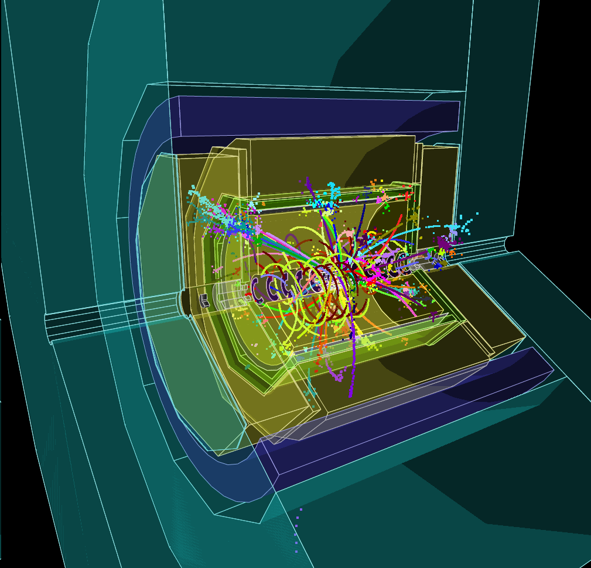](figures/ttbar_500GeV_3dview-41.png)

 
-----
Flavour tag performance for the large and small ILD detector models. Background rate as a function of the c-tagging (left) and b-tagging (middle) efficiency for heavy quark and light flavour quark jets.  Right: Material budget in ILD up to the calorimeter, in fraction of a radiation length .The different contributions are summed up to represent the cumulative radiation length at a given polar angle.(Figures from \cite{ILDConceptGroup:2020sfq})}
 
[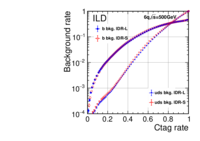](figures/ctag_performance.pdf)[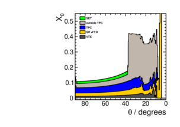](figures/ILD_l5_v02_matbudget_tracker_85deg.pdf)

- #####  ILD Concept Group collaboration, International Large Detector: Interim Design Report, https://arxiv.org/abs/2003.01116  2003.01116.  

 
-----
Layout of the inner Silicon (SIT) and forward Silicon (FTD) trackers surrounding the vertex detector.
 

 
-----
 Left: Simulated resolution in $1/p_t$ as a function of the momentum for single muons. The different curves correspond to different polar angles. Right: Simulated separation power between pions and kaons {and between kaons and protons}, from $dE/dx$ and from timing, assuming a 100 ps timing resolution of the first ECAL layers (Figures from \cite{ILDConceptGroup:2020sfq}).}
 
[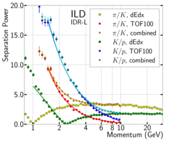](figures/Special_Combined_dEdx_TOF100_IDR.pdf)

- #####  ILD Concept Group collaboration, International Large Detector: Interim Design Report, https://arxiv.org/abs/2003.01116  2003.01116.  

 
-----
Left: Three-dimensional rendering of the barrel calorimeter system, with one ECAL stave partially extracted. Right: Prototype module of the lumical calorimeter.
 

 
-----
Map with the location of the ILD member institutes indicated.
 
[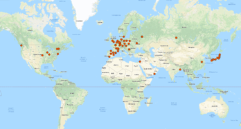](figures/ILD_members_map.pdf)

 
-----
The SiD detector concept. 
 
[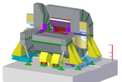](figures/SiD.pdf)

 
-----
r-z view of vertex detector and outer tracker. 
 
[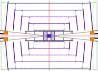](figures/vxdtrk.pdf)

 
-----
Material in the SiD detector, in terms of fractions of a radiation length, as a function of the polar angle.
 
[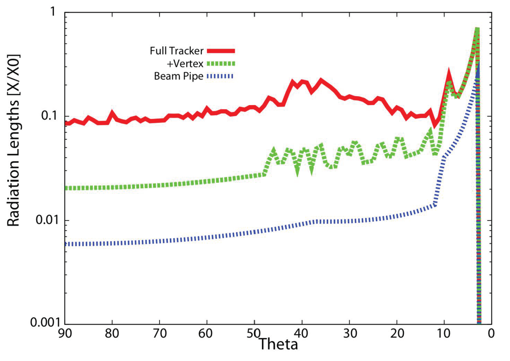](figures/SiD_material_budget_tracker.png)

 
-----
Left: Picture of a GaAs sensor. The bond pads are visible on top of the sensor, Right: Cross-profile of a GaAs sensor. The aluminum traces are positioned between the pads, on the top of the passivation layer.
 
[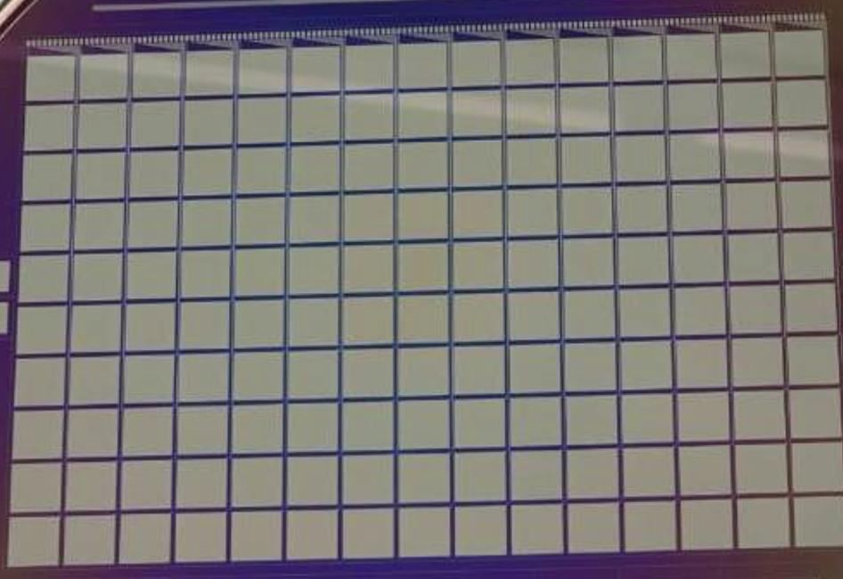](figures/ECAL_GAAS_pic.png)[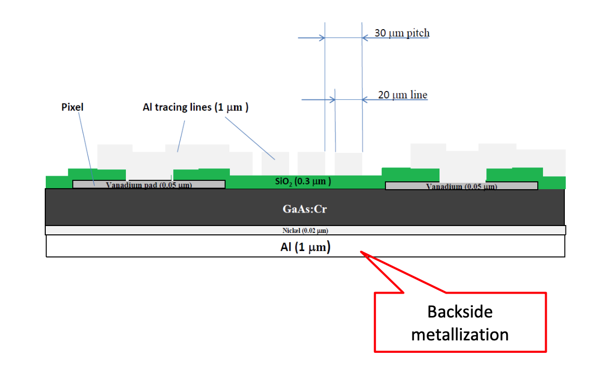](figures/ECAL_GAAS_cut.png)

 
-----
Left: Picture of the surface of a GaAs sensor. The aluminum traces are positioned between the pads, on the top of the passivation layer, Right: The leakage current of a pad as a function of the bias voltage, measured at $20^\circ$C.
 

 
-----
Distribution of signals measured with the GaAs pad sensors in an electron beam of 5 GeV.
 
[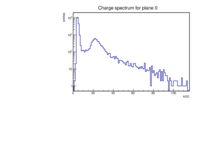](figures/ECAL_signal_distribution.pdf)

 
-----
Left: Picture of a metallised sapphire sensor, Right: Schematic view of the sapphire sensor stack, consisting of 8 sensors.The direction of the beam electrons is indicated by the arrow and represents the z-coordinate. The y coordinate is perpendicular to the sensor plane.
 
[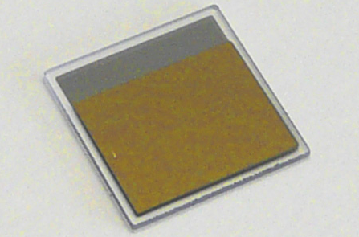](figures/Sapphire_sensor.png)

 
-----
Image of the stack using electron tomography
 
[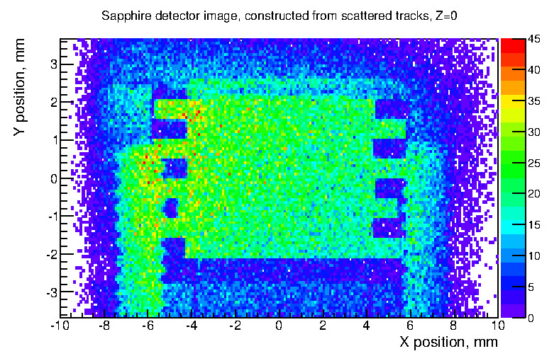](figures/Sapphire_stack_image.jpg)

 
-----
Left: Digitised analog signals for bias voltages of 550 (red) and 950 V (black) as a function of the time, Right: The CCD measured for all sensor plates a function of the bias voltage.
 
[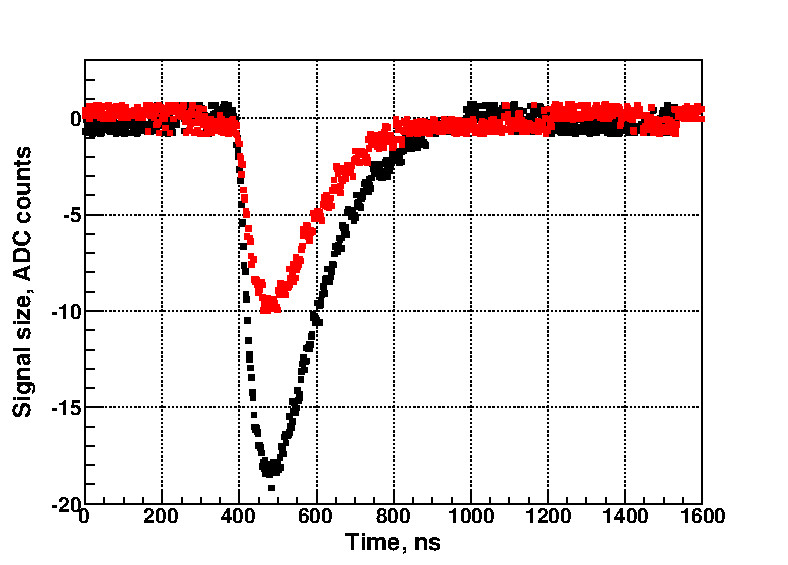](figures/Sapphire_analog_signal.jpg)

 
-----
Proposed gaseous RICH detector addition to SiD/ILD \cite{CairoVavra}.
 
[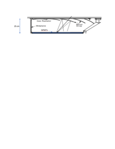](figures/RICH4ILC.pdf)

- ##### V. Cairo and J. Vavra, in preparation,  2022.  

