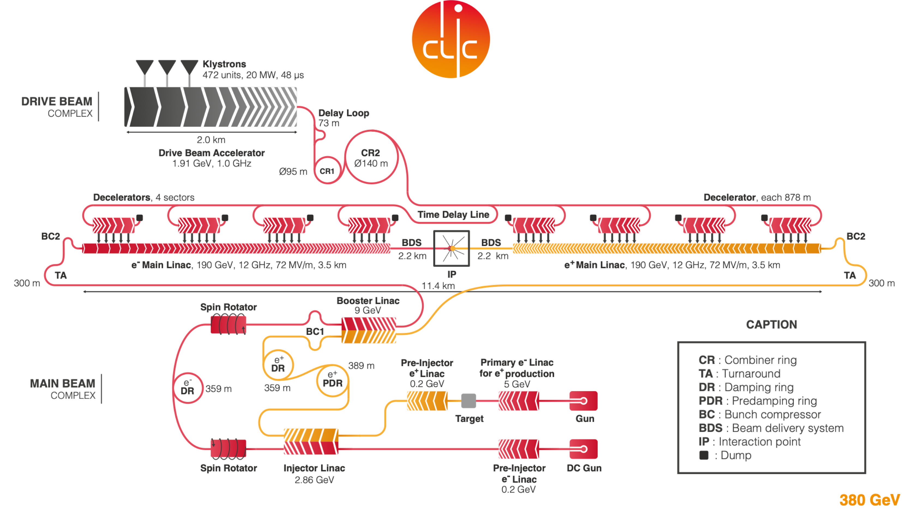

- Left: Cross section of the two leading diHiggs production modes in a lepton collider as a function of the center-of-mass energy. Right: Dependence of the signal strengths on the trilinear coupling of the Higgs with the horizontal bands showing the estimated sensitivities.
 
 

- Composite Higgs reach from Higgs boson, top quark and Drell-Yan studies taken from Refs.~\cite{deBlas:2018mhx} and \cite{CLICdp:2018esa}. Left panel: $5\sigma$ discovery contours for Higgs compositeness in the $(m_{*},g_{*})$ plane, and as well the $2\sigma$ projected exclusions from the HL-LHC. Right panel: The $5\sigma$ top quark compositeness discovery contours in the $(m_{*},g_{*})$ planes from studies of $t\overbar{t}$ and $t\overbar{t}h$ final states. In both panels, darker and lighter shaded areas correspond to the variations of the size of the operators' coefficients by a factor of 2 or 1/2 on top of the baseline expectation from the values of $m_{*}$ and $g_{*}$.}
 
 
J. de Blas et al., The CLIC Potential for New Physics, https://arxiv.org/abs/1812.02093  1812.02093.  

- Reach of direct searches for Dark Matter. Left panel: 95\
 
 

-  \centering \includegraphics[scale=0.3,clip]{chapters/farfuture/figures/CLIC_wino.pdf} \includegraphics[scale=0.3,clip]{chapters/farfuture/figures/CLIC_higgsino.pdf}Event rates and exclusions for the wino and higgsino signal in the lifetime vs. mass plane. Orange: darker region corresponds to $N > 30$ events in the CLIC acceptance, lighter orange regions corresponds to $N > 3$ events and correspond to a projected 95\ background. The left (right) panel refers to the RPV wino (higgsino) signal. Blue region: the recasted current and HL-LHC (3 $\rm ab^{-1}$) projected 95\ \label{fig:LLPCLIC}
 
 

-  \centering \includegraphics[scale=0.4,clip]{chapters/farfuture/figures/CLIC_hportal.pdf}Blue line: HL-LHC projected 95\ \label{fig:hportal}
 

- Schematic layout of the CLIC complex at \SI{380}{\GeV}.
 

- \label{fig_IMP_9} \small Technology and construction-driven CLIC schedule. The time needed for reconfiguration (connection, hardware commissioning) between the stages is also indicated.}
 

