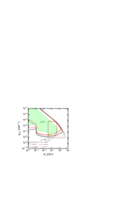
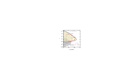
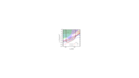
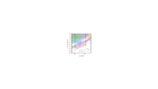

 
-----
Distribution of beam dumps over the ILC facility. The electron, positron and photon beamlines are colored blue, red and yellow, respectively. 
 

- ##### A. Aryshev et al., The International Linear Collider: Report to Snowmass 2021, arXiv:2203.07622 

 
-----
The reach of a beam-dump experiment at the ILC-250 for axion-like particles (left) and dark photons (right). Taken from Ref. \cite{Asai:2021ehn}. See also \cite{Sakaki:2020mqb} for another study of the reach on axion-like particles.
 

- ##### K. Asai, S. Iwamoto, Y. Sakaki and D. Ueda, New physics searches at the ILC positron and electron beam dumps, https://doi.org/10.1007/JHEP09(2021)183 JHEP   09 (2021) 183 [https://arxiv.org/abs/2105.13768  2105.13768].  

- ##### Y. Sakaki and D. Ueda, Searching for new light particles at the international linear collider main beam dump, https://doi.org/10.1103/PhysRevD.103.035024 Phys. Rev. D   103 (2021) 035024 [https://arxiv.org/abs/2009.13790  2009.13790].  

 
-----
Reach of the ILC search for dark photon decaying invisibly to a pair of stable dark matter particles. For comparison, the current constraints (shaded) and reach of proposed BDX and LDMX experiments are also shown. Blue lines indicate the parameters where the DM thermal relic density matches the observed value. 
 

- ##### A. Aryshev et al., The International Linear Collider: Report to Snowmass 2021, arXiv:2203.07622 

 
-----
Sensitivity of the ILC version of the LUXE-NPOD experiment \cite{Bai:2021dgm} searching for scalar and axion-like particles that couples to photons.  The sensitivity is expressed in terms of parameters $\Lambda_a$ and $\Lambda_\phi$ defined in eq. \leqn{LforALPs}.}
 

- ##### Z. Bai et al., LUXE-NPOD: new physics searches with an optical dump at LUXE,  https://arxiv.org/abs/2107.13554  2107.13554.  

