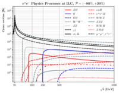
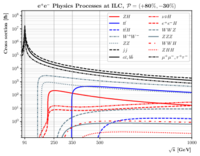
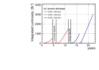
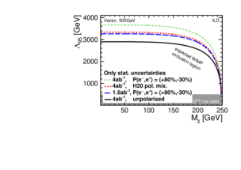
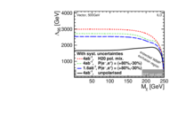
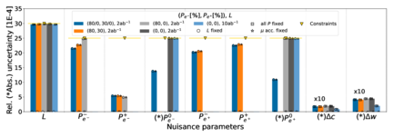
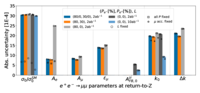

 
Cross sections of the most important Standard Model processes in $\ee$ annihilation in the energy range of the ILC.  Initial state radiation is included, and cross section are plotted for reactions in which the annihilation retains $>90\ not-so-subtle differences.}
 
 

 
The plan for the operation of the ILC through its various stages from 250~GeV to 500~GeV that is used in this report for projections of the physics results expected from the ILC. The details of this program most relevant for physics studies are shown in Table~\ref{tab:ILC-staging}.   The detailed accelerator parameters for each stage are given in Table~\ref{tab:ilc-params}.   The total length of the program is 22~years.   Additional stages at the $Z$ boson resonance and at 1~TeV could be added to this plan.   Parameters for these programs are also presented in Table~\ref{tab:ILC-staging}.}
 

 
Limits on an Effective Field Theory mass scale associated with dark matter particle pair production in $\ee$ annihilation from a search simulation at 500~GeV, showing the dependence of the results on beam polarization, from \cite{Habermehl:2018yul}.  Higher limits are better.   In both figures, the black curve is an analysis for unpolarized beams, the red (short-dash) curve corresponds to the mixture of  polarization states  in Table~\ref{tab:ILC-staging}.    Left: analysis with statistical errors only; Right:  analysis including both statistical and systematic errors.}
 
 

- ##### M. Habermehl, Dark Matter at the International Linear Collider, Ph.D. thesis, Hamburg U., Hamburg, 2018. \newblock 10.3204/PUBDB-2018-05723.  

 
Precision to which (a) nuisance parameters, including the beam polarizations, and (b) 2-fermion physics parameters are determined from the combined $e^+e^-\to \mu^+ \mu^-$ and $e^+e^-\to \mu^{\pm} \nu_{\mu} jj$ fit under different assumptions on the integrated luminosity and the beam polarizations. The yellow triangles with horizontal lines indicate the level of external constraints from the luminosity measurement and the polarimeters.
 
 

