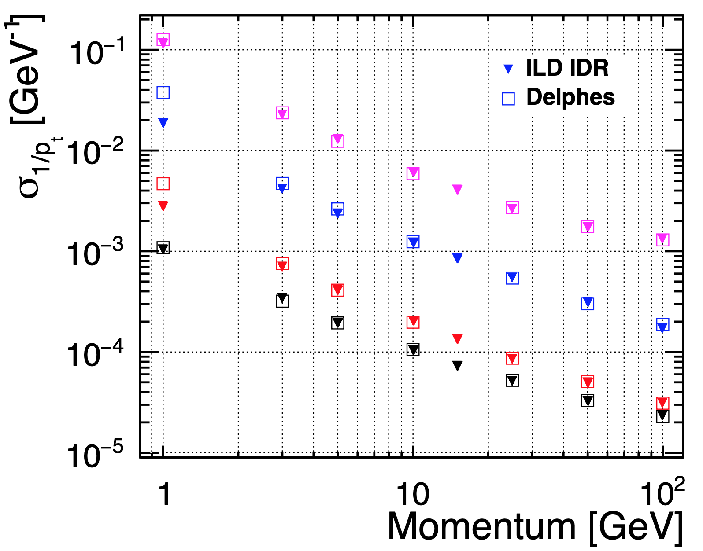
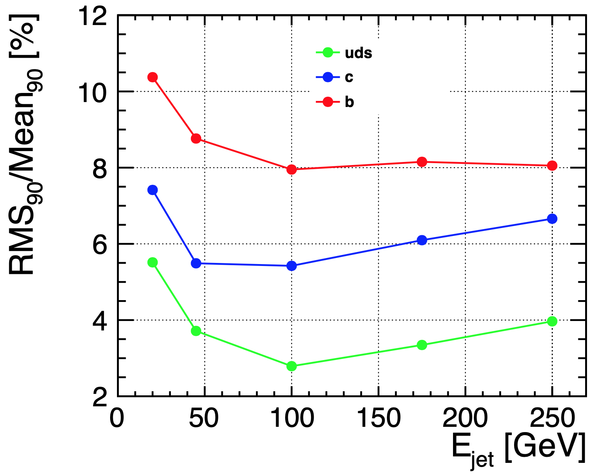
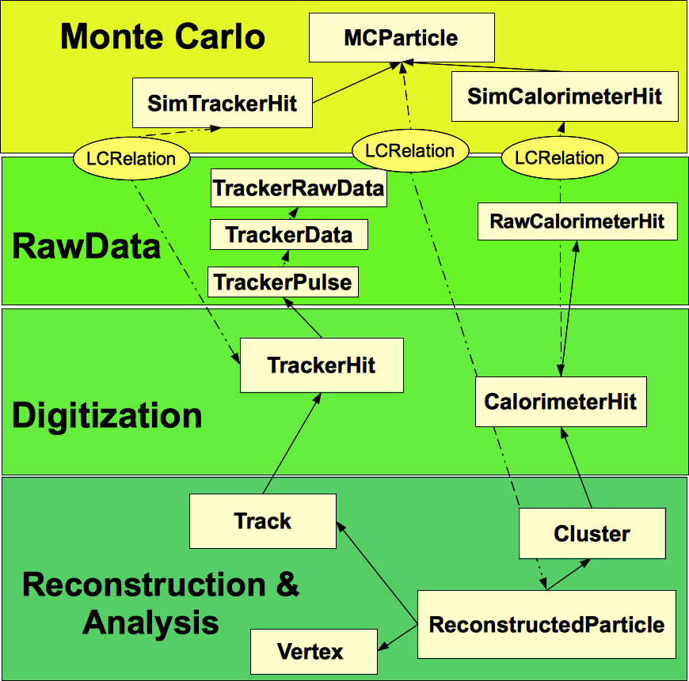

 
 \label{fig:sim:delphes_trk}  \label{fig:sim:delphes_pfa}(a): transverse momentum resolution for different polar angles for the ILD full simulation and for the ILCgen \delphes parameterization. (b): jet energy resolution for the ILCgen simulation }
 
 

 
 \label{fig:sim_sid_tracker} \label{fig:sim_materialscan_vxd}(a): cut-away view of the tracking system as implemented in the \emph{SIDLOI3} simulation model (from~\cite{Behnke:2013lya}). (b): Material scan in inner tracking region of the ILD simulation model showing detector components of the VTX, SIT and FTD as well as dead material from the beam pipe, support structures, cables and services. Plotted is the local material budget per bin in units of X0 with an arbitrary scaling factor applied.)\label{fig:inner_trackers} }
 
 

- ##### H. Abramowicz et al., The International Linear Collider Technical Design Report - Volume 4: Detectors, https://arxiv.org/abs/1306.6329  1306.6329.  

 
 \label{fig:pair_bg_cone_ild} \label{fig:pair_bg_cone_sid}\label{fig:pair_bg_cone} (a): Cones of incoherent  $e^+e^-$-pairs in the ILD detector for $E_{cms}=250~GeV$ as created with GuineaPig. Shown is $\log{p_t}$ of the particles (radius of the helical trajectory) as a function of $\log{\theta}$. Also shown are the inner detector elements of the ILD detector (horizontal lines represent barrel elements and diagonal lines represent end-cap elements).   (b): Cone of background from incoherent $e^+e^-$-pairs, generated with Guinea-Pig and simulated in the 5 T B-field of the SiD detector (from~\cite{Schutz:2017ihd}). }
 
 

- ##### A. Sch\"utz, Pair Background Envelopes in the SiD Detector,  in Proceedings, International Workshop on Future Linear Colliders 2016 (LCWS2016): Morioka, Iwate, Japan, December 05-09, 2016, 2017 [https://arxiv.org/abs/1703.05737  1703.05737].  

 
 \label{fig:lcio_schema} \label{fig:minidst_workflow}(a): Schematic view of the hierarchical event data model of LCIO. (b): Using the miniDST format a common analysis code can be developed that works with all simulation and reconstruction tools presented above. }
 
 

